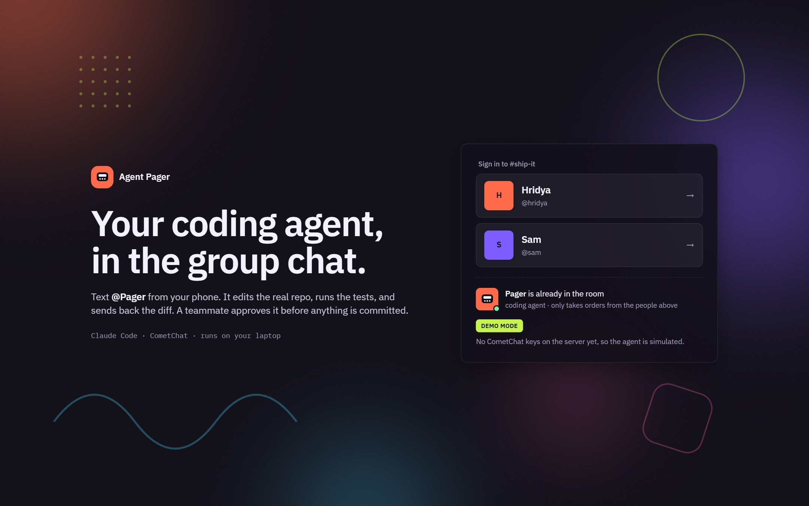
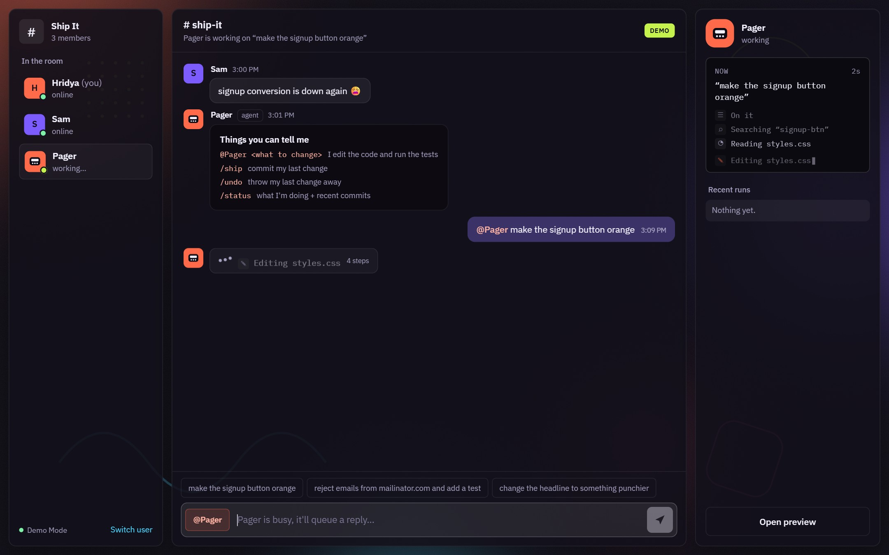
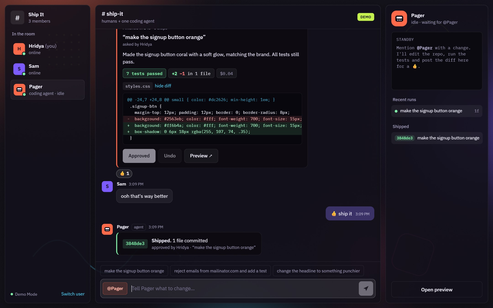
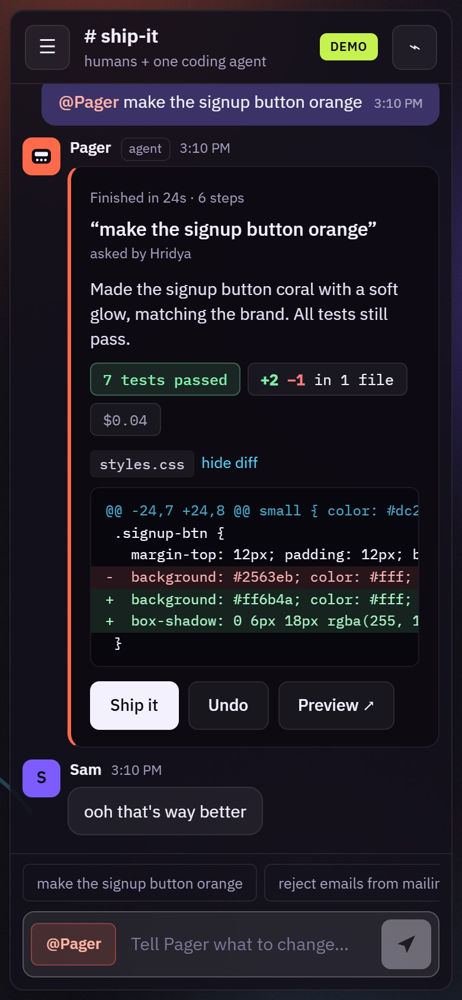
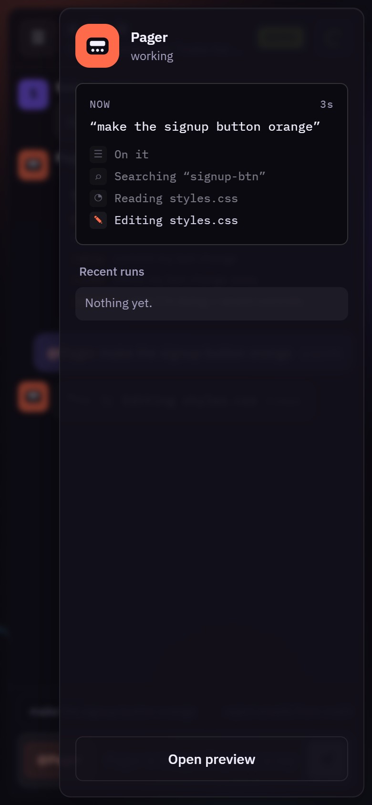
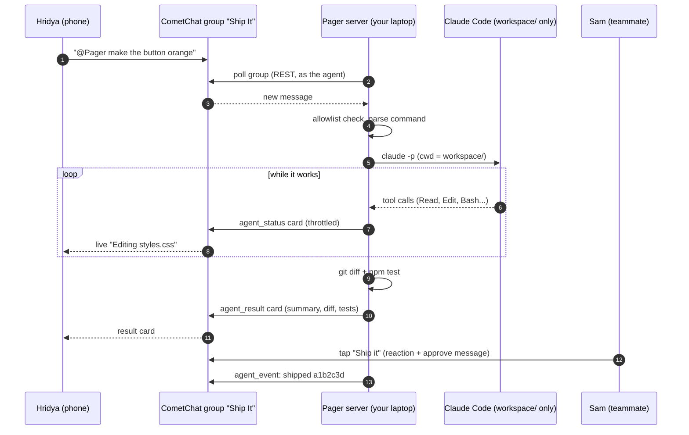
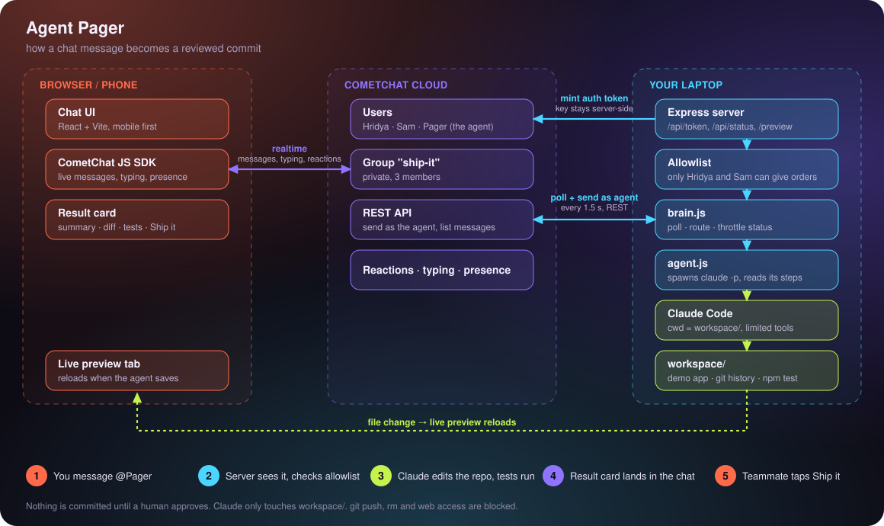

# Agent Pager

**Your coding agent, in the group chat.**

You're away from your laptop. You text `@Pager make the signup button orange` from your phone. Claude Code edits the real repo, runs the tests, and drops the result into the chat as a card: summary, diff, test results. A teammate taps **Ship it**, and only then does anything get committed.

No dashboards, no terminal babysitting. Just a group chat where one of the members happens to write code.

> Built for **Zero to Chat** (#ZeroToChat) with Claude Code and the [CometChat MCP](https://mcp.cometchat.com/mcp?ref=z2c) connector, registered in [`.mcp.json`](.mcp.json).

## See it

<p align="center"></p>

<p align="center"></p>
<p align="center"><sub>Pager mid-run. The chat shows what it's doing right now; the console on the right keeps the full step list.</sub></p>

<p align="center"></p>
<p align="center"><sub>The result card after approval, and the "Shipped" confirmation with its commit hash.</sub></p>

<table align="center">
  <tr>
    <td align="center"></td>
    <td align="center"></td>
  </tr>
  <tr>
    <td align="center"><sub>Result card on a phone</sub></td>
    <td align="center"><sub>Agent console, slid in mid-run</sub></td>
  </tr>
</table>

> These screenshots come from the app's built-in Demo mode (a simulated agent, no keys needed). The interface is the same one that runs against live CometChat and Claude Code.

## How it works



The agent is a real CometChat user. It reads and writes the group through the REST API, so to the chat it's just another member with a presence dot.

## Architecture



| Piece | What it does | Where |
|---|---|---|
| **Chat UI** | Group chat with live agent steps, result cards, an agent console and a Demo mode when no keys are set | `web/src` |
| **Token minting** | Browser asks the server for a login token; the REST key never reaches the page; only allowlisted users get one | `server/index.js` |
| **Brain** | Polls the group, checks the sender is allowed, parses `@Pager`, `/ship`, `/undo`, `/status`, `/new`, throttles status updates | `server/brain.js` |
| **Agent runner** | Starts `claude -p` in `workspace/`, turns each tool call into a readable step, collects the diff and the test result | `server/agent.js` |
| **CometChat client** | Users, groups, auth tokens, send-as-agent, list messages | `server/cometchat.js` |
| **Workspace** | "Launchpad", a small signup page with a `node:test` suite; its git history lives in `.pager-git` so it never nests inside this repo | `workspace/` |

### Three kinds of custom message

The agent talks in rich cards, not walls of text. Each one is a CometChat custom message the UI renders.

| `type` | Shown as |
|---|---|
| `agent_status` | the live "working…" bubble and the console's step list |
| `agent_result` | summary, test badge, files changed, colour-coded diff, **Ship it / Undo** |
| `agent_event` | shipped (commit hash), discarded, help, status, errors |

### Limits that shaped the design

All found through the CometChat MCP's docs search, not guessed:

- **30 messages per minute per user**, so status updates are throttled to one every 2.5 seconds.
- **10 KB cap on a custom message's data**, so diffs are trimmed to about 4 KB and flagged as truncated.
- Auth Keys don't belong in a browser, so tokens are minted server-side, the pattern from the `multi-tenant-chat` bundle.

## What CometChat does here

| CometChat feature | Used for |
|---|---|
| JS Chat SDK | Login with server-minted tokens, history, live messages |
| Groups and users (REST) | `npm run setup` creates the agent, two humans and the group |
| Custom messages | Status, result and event cards |
| Send as a user (`onBehalfOf`) | The agent speaks as a real member |
| Presence and typing | Online dots, "Sam is typing…", the agent's busy state |
| Reactions | 👍 on a result card is the approval |
| Custom Agent callback | Optional `AGENT_MODE=callback`: CometChat pushes messages to `POST /cometchat/callback` instead of polling |

## How the CometChat MCP was used

`.mcp.json` points Claude Code at `https://mcp.cometchat.com/mcp?ref=z2c`. During the build it was used to:

- **`list_cometchat_bundles`**, then **`get_cometchat_implementation_bundle`** for `js-sdk-messaging-basics`, `presence-and-typing` and `multi-tenant-chat`. These became the init, login, listener and typing code in `web/src/lib/chat.js`.
- **`fetch_cometchat_doc_page`** for the REST pages (send bot message, list group messages, create group, update message), custom agents and reactions. These shaped `server/cometchat.js` and `server/brain.js`.
- **`search_cometchat_docs`** for rate limits and message size limits, which drove the throttling and diff trimming above.

## Safety

An agent that edits files on request needs boundaries:

- **Allowlist.** Only the UIDs in `HUMANS` can log in or give orders. Anyone else gets a polite refusal.
- **Sandboxed folder.** Claude runs with `cwd = workspace/` and `acceptEdits`.
- **Tool allow-list.** Read, edit, search, and `npm test` only. `git push`, `rm`, web fetch and web search are denied.
- **Human approval.** Nothing is committed until someone presses **Ship it**. **Undo** restores the folder.
- **Keys stay server-side.** The REST key never reaches the browser, and `.env` is git-ignored.

## Run it

You need Node 20+, Claude Code (logged in), and a free CometChat account.

```bash
npm run install:all
cp .env.example .env     # add COMETCHAT_APP_ID, COMETCHAT_REGION, COMETCHAT_REST_API_KEY
npm run setup            # creates users and the "Ship It" group (safe to re-run)
npm start                # builds the web app, serves everything on http://localhost:8787
```

- The REST API key is in **app.cometchat.com → your app → API & Auth Keys**.
- **Phone:** run `npm run tunnel` and open the `trycloudflare.com` link it prints.
- **Rehearse without Claude:** `MOCK_AGENT=1` in `.env` uses real CometChat with a fake agent.
- **No keys at all:** `npm start` still opens, in a clearly labelled Demo mode with a simulated agent.

### Commands in the chat

| Message | Effect |
|---|---|
| `@Pager <change>` | Claude makes the change, runs `npm test`, posts a result card |
| **Ship it** or `/ship` | Commit the change |
| **Undo** or `/undo` | Throw it away |
| `/status` | What it's doing plus recent commits |
| `/new` | Forget the conversation, start a fresh Claude session |

## Project layout

```
.mcp.json      CometChat MCP connector (project scope)
server/        Express: tokens, poller, Claude runner, live preview  (8 unit tests)
web/           React + Vite chat app, mobile-first
workspace/     "Launchpad", the demo app the agent edits              (7 tests)
```

```bash
npm test       # server tests + workspace tests
```

## Why this idea

CometChat's own pitch is "your coding agent writes the chat code". Agent Pager turns that around: the coding agent is a *participant* in the chat. Anything you can say to a teammate, you can say to it, and the teammate watching can stop it, approve it, or steer it.
